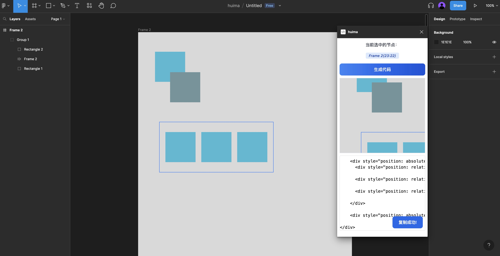

# huima

[中文](https://github.com/tolerance-go/huima/blob/main/README.ZH-CN.md)

> A small plug-in that seamlessly connects figma design resources and code, welcome to build together!ヾ(@^▽^@)ノ

## Features

- [x] Support text base style conversion
- [x] Support RECTANGLE, ELLIPSE, VECTOR graphics basic style conversion
- [x] support group, frame layout base style transitions
- [x] Support AutoLayout to CSS style conversion
- [ ] Support image basic style conversion
- [ ] Support conversion of tailwindcss related class names

