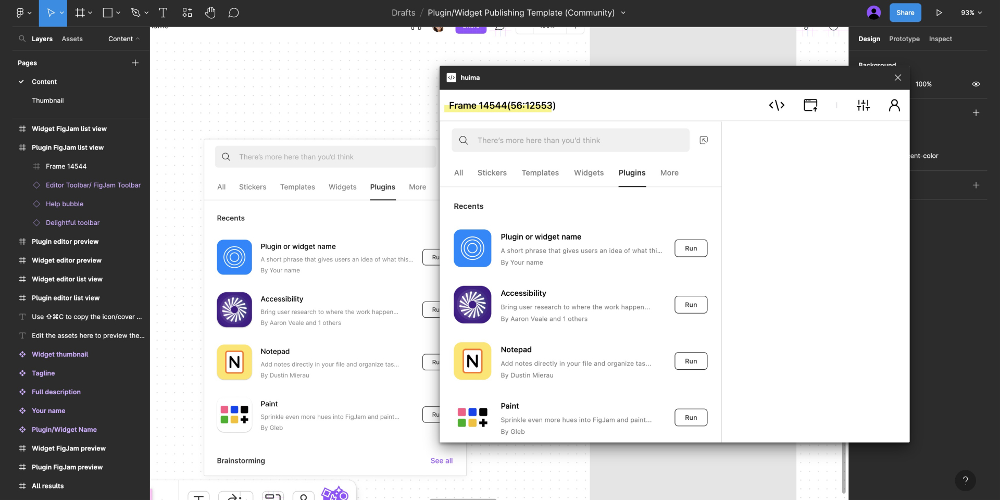

# Huima

> Instantly export designs into production-ready code

> Have you recently been bombarded by AIGC with piles of design content appearing endlessly, and still exporting design annotations and cutting maps? `huima` can help you convert designs into UI-consistent, clean and tidy interface code (supporting responsive units and tailwindcss conversion) with just one click. We have launched corresponding plugins for figma and jssj design, allowing developers to bid farewell to cumbersome design comparison and restoration. Give it a try, we're currently in the beta testing phase. You're welcome to join the discussion group by scanning the QR code. The code is open source and contributions are welcome!

The `huima` plugin helps you export existing design resources into UI-consistent, clean, and neat front-end application code, enabling you to quickly generate from 0 to 1.

## Features

-  [x] Support for basic style conversion of text and images
-  [x] Support for basic style conversion of geometric shapes like RECTANGLE, ELLIPSE, Vector, etc.
-  [x] Support for basic style conversion of Group, Frame layouts
-  [x] Support for AutoLayout to Flex style conversion
-  [x] Support for conversion of Figma components and instance types
-  [x] Support for code copying and resource export
-  [x] Support for conversion of px units to rem, vw
-  [x] Support for conversion to tailwindcss-related class names

## Test Cases

-  https://www.figma.com/community/file/1241686726614575415

