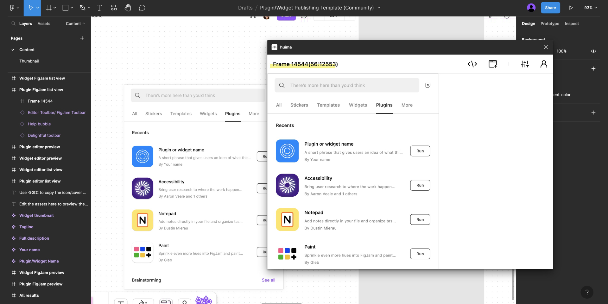

# 绘码

> 将设计极速导出为开发可用的代码

> 最近有没有被 AIGC 刷爆，海量的设计内容成堆出现，还在导出设计标注和切图吗？绘码可以帮你把设计一键转为 UI 一致，干净整洁的界面代码（支持响应式单位和 tailwindcss 转换），针对 figma 和即时设计推出了相关插件，让前端告别烦杂的设计比对还原工作，专注动态设计开发，赶紧试一下吧，现在是内测阶段，欢迎扫码加群讨论，代码已开源，欢迎共建！

`绘码`插件帮助您将已有的设计资源导出为 UI 一致、干净整洁的前端应用代码，从 0 到 1 极速生成

## 插件

-  [figma](https://www.figma.com/community/plugin/1239442570532327240)

## 功能

-  [x] 支持文本，图片基本样式转换
-  [x] 支持 RECTANGLE，ELLIPSE，Vector 等几何图形基本样式转换
-  [x] 支持 Group，Frame 布局基本样式转换
-  [x] 支持 AutoLayout 到 Flex 样式转换
-  [x] 支持 Figma 组件和实例类型转换
-  [x] 支持代码复制及资源导出
-  [x] 支持 px 单位到 rem，vw 的转换
-  [x] 支持转换 tailwindcss 相关类名

## 测试用例

-  https://www.figma.com/community/file/1241686726614575415
